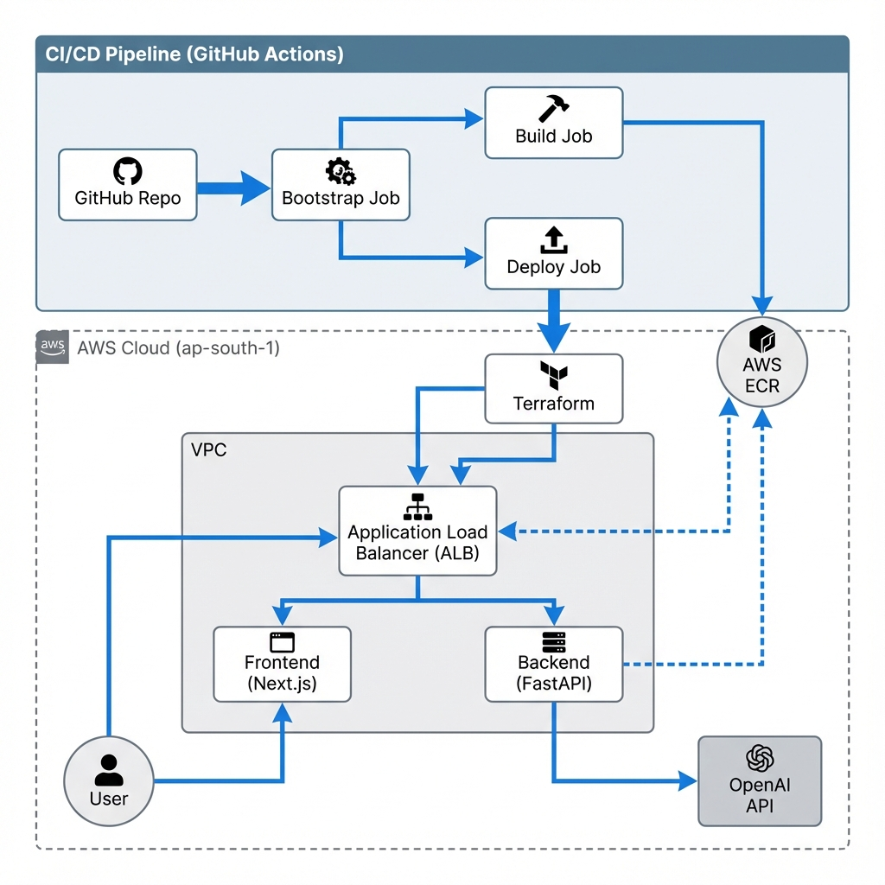

# AssetIQ System Architecture

This document outlines the high-level architecture of the AssetIQ application, including the AWS infrastructure, application components, and the CI/CD pipeline.

## System Overview

The application is deployed on AWS using **ECS Fargate** for serverless container orchestration. It uses a **Next.js** frontend and a **FastAPI** backend, both served behind a single **Application Load Balancer (ALB)**.

### Architecture Diagram

## Component Details

### 1. Networking (VPC)
-   **VPC**: Custom VPC with Public and Private subnets.
-   **ALB (Application Load Balancer)**:
    -   Serves as the single entry point for all traffic.
    -   **Listener (Port 80)**: Routes traffic based on path rules.
    -   **Default Rule**: Forwards to the **Frontend** Target Group.
    -   **Path Rule `/api/*`**: Forwards to the **Backend** Target Group.

### 2. Compute (ECS Fargate)
-   **Cluster**: `assetiq-test-cluster`.
-   **Frontend Service**:
    -   Runs the Next.js container.
    -   Exposes port `3000`.
    -   Auto-assigns public IP (running in public subnets for simplicity/cost).
-   **Backend Service**:
    -   Runs the FastAPI container.
    -   Exposes port `8000`.
    -   Connects to OpenAI API for chat functionality.

### 3. CI/CD Pipeline (`ci-cd.yml`)
1.  **Bootstrap Phase**:
    -   Checks/Creates critical prereqs: **S3 Bucket** (Terraform State), **DynamoDB** (Locks), and **ECR Repositories**.
    -   Ensures "infrastructure for infrastructure" exists before anything else.
2.  **Build Phase**:
    -   Builds Docker images for Frontend and Backend.
    -   Tags images with the unique **GitHub Run ID** (e.g., `123456789`).
    -   Pushes images to **ECR**.
3.  **Deploy Phase**:
    -   Runs Terraform.
    -   Injects the **GitHub Run ID** as `backend_image_tag` / `frontend_image_tag`.
    -   Updates ECS Task Definitions to use the exact images just built.
    -   ECS handles the rolling deployment (zero-downtime).

## Data Flow
1.  **User Access**: User visits the ALB DNS URL.
2.  **Frontend**: ALB routes request to Next.js container. Page loads.
3.  **API Call**: User clicks "Compare". Frontend calls `/api/chat`.
4.  **Routing**: ALB sees `/api/` path and routes request to FastAPI container.
5.  **AI Processing**: FastAPI calls OpenAI API and returns comparison data.

To get started and build this yourself .
Start by going through the README_2.md file.
